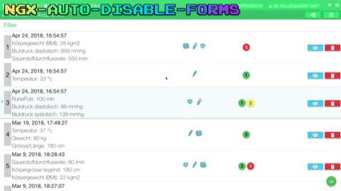

# ngx-auto-disable-forms
This module checks roles and permissions of the current signed in user and disables input fields on demand automatically. That means you don't have to disable each form input field individually. Currently supports: buttons, input fields, text areas, checkboxes, selects.

# Demo


# Getting started

## Installation
```javascript
npm i ngx-auto-disable-forms --save
```

## Import
Just import the module **'NgxAutoDisableFormsModule'** in your **'app.module.ts'** file.
i.e. 
```javascript
import { NgxAutoDisableFormsModule } from 'ngx-auto-disable-forms';

@NgModule({
  imports: [
      NgxAutoDisableFormsModule
  ],
})
```

## Interface Implementation
Go to your component, where fields should be disabled. And implement the interface **'OnRolesAndPermissions'** i.e.
```javascript
@Component({
  selector: 'test-component',
  templateUrl: './test.component.html',
  styleUrls: ['./test.component.scss'],
})
export class TestComponent implements OnRolesAndPermissions {

  /**
   * @override
   * Checks if the view should be displayed in read only mode.
   *
   * @returns if true, the view's input form fields are disabled.
   */
  isViewReadOnly(): boolean {
      return true; // depends on roles and permissions
  }

}
```

## Template
Note that you need to add the attribute **'rolesAndPermissionsRelatedContent'** to the div container inside of the components template. 
Depending on roles an permissions all UI input fields inside the div will be disabled automatically.
i.e. 
```javascript
<div rolesAndPermissionsRelatedContent>
...
your form inputs
...
</div>
```

If needed you can also exclude some input fields from being disabled by adding the css class **'exclude-from-roles-and-permissions'**
i.e. 
```javascript
<button class="exclude-from-roles-and-permissions"></button>
```

## Optional
If you want you can provide a roles and permission service, to do this create a service and implement the service **'RolesAndPermissionsServiceInterface<T>'**
```javascript
import { Injectable, Inject } from '@angular/core';
import { RolesAndPermissionsServiceInterface } from 'ngx-auto-disable-forms';

@Injectable()
export class UserRolesAndPermissionsService implements RolesAndPermissionsServiceInterface<UserModel> {

  constructor(private userRolesService: UserRolesService) { }

  hasOnlyReadPermissions(user: UserModel): boolean {
      return this.userRolesService.hasOnlyReadPermissions(user);
  }

  isAuthorized(user: UserModel): boolean {
      return this.userRolesService.isUserAuthorized(user);
  }

  hasWritePermissions(user: UserModel): boolean {
      return this.userRolesService.hasWritePermissions(user);
  }

}
```

Additionally you need to provide the service in the **'app.module.ts'** file
```javascript
import { NgxAutoDisableFormsModule, RolesAndPermissionsService } from 'ngx-auto-disable-forms';

@NgModule({
  imports: [
      NgxAutoDisableFormsModule
  ],
  providers: [
    // optional
      UserRolesAndPermissionsService, 
      {
          provide: RolesAndPermissionsService,
          useExisting: UserRolesAndPermissionsService
      },
  ]
})
```

Now you can use your service in your component
```javascript
@Component({
  selector: 'test-component',
  templateUrl: './test.component.html',
  styleUrls: ['./test.component.scss'],
})
export class TestComponent implements OnRolesAndPermissions {

  constructor(private userRolesAndPermissionsService: UserRolesAndPermissionsService) {}

  /**
   * @override
   * Checks if the view should be displayed in read only mode.
   *
   * @returns if true, the view's input form fields are disabled.
   */
  isViewReadOnly(): boolean {
      return this.userRolesAndPermissionsService.hasOnlyReadPermissions(this.currentUser);
  }

}
```
